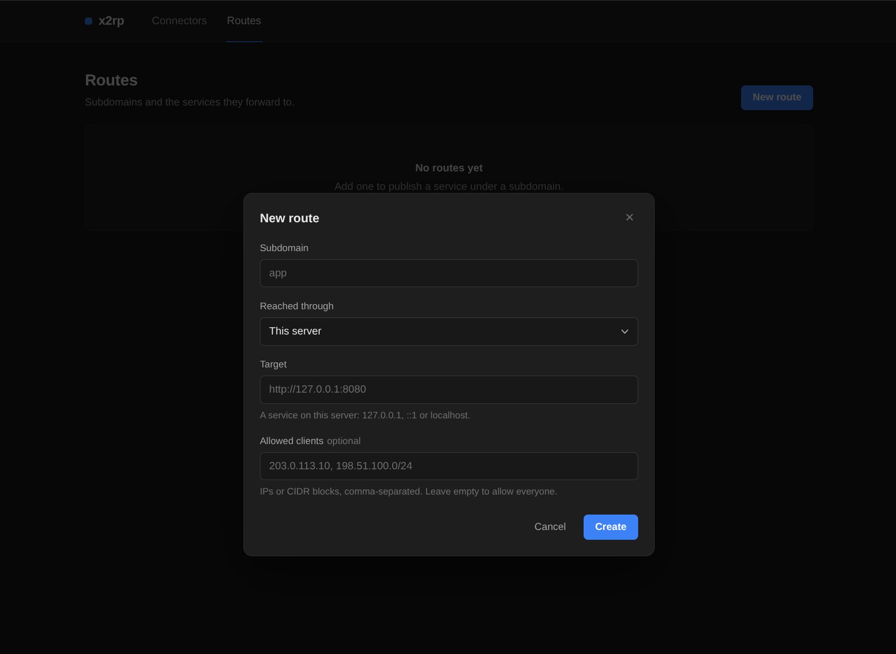

# x2rp

x2rp is a reverse proxy, written in Rust, that publishes HTTP services under
subdomains of one domain. It obtains a Let's Encrypt certificate for the
domain and its wildcard and renews it without operator involvement. Services
can run on the proxy host or on private networks reached through a connector
that dials out to the server, so private networks need no inbound ports, port
forwarding or public address.

x2rp is minimal by design. It does not do load balancing, path-based routing,
caching or plugins. The server and connector are single static binaries for
x86_64 and aarch64 Linux, with no database or other runtime dependencies.
All server state is kept in plain files under `/var/lib/x2rp`, written
atomically, so a backup is a copy of that directory. Each side installs with
one command.

Configuration is done through a simple web console at
`https://x2rp.<domain>`. It has two pages: Routes, where routes are created,
edited, deleted and switched on or off, with targets checked before saving,
and Connectors, which shows each connector's status, transport and last seen
time and generates its install command. Changes take effect immediately,
without a restart. The console is plain HTML, CSS and JavaScript, embedded in
the server binary, and loads no external resources.



## Design

### Edge proxy

The edge is built on [Pingora](https://github.com/cloudflare/pingora). It
terminates TLS 1.2 and 1.3 on TCP 443 and routes each request by `Host` to a
loopback origin or a connector; unknown hosts get `404`. TCP 80 redirects the
domain and its subdomains to HTTPS and answers anything else with `400`.

Origins receive `X-Forwarded-For`, `X-Real-IP`, `X-Forwarded-Proto` and
`X-Forwarded-Host` set by the proxy, and any client-supplied `Forwarded`
header is removed. Responses carry an `X-Request-Id`, plus HSTS,
`X-Content-Type-Options`, `Referrer-Policy` and `X-Frame-Options` where the
origin did not set them. The console itself is served through the same edge
from the admin API on `127.0.0.1:8800`.

### Connectors

A connector authenticates with a bearer token. Before each connection it
fetches its settings from the server; a rejected token (connector deleted or
token regenerated) makes it exit and stay stopped.

The connector prefers QUIC on UDP 443, where each proxied connection gets its
own stream with its own flow-control window (256 KiB within a 1 MiB
connection window), so a single slow or lossy stream does not stall the
others. If QUIC cannot be used, or the connector is set to **WebSocket only**,
it uses WebSocket over TLS on TCP 443, multiplexing streams with per-stream
flow control; a slow client then pauses only its own stream, although TCP
head-of-line blocking still applies. A connector therefore works on any
network that allows direct outbound connections to TCP 443.

QUIC datagrams are masked with ChaCha8 and a random per-packet IV so that the
tunnel is not easily identified as QUIC by deep packet inspection. The key is
server-wide and handed only to authenticated connectors. This layer is
camouflage; security comes from QUIC's TLS 1.3, with the connector verifying
the server's certificate against the system trust store.

The connector does not parse HTTP. It splices bytes between each stream and
its backend, so streamed responses and WebSocket upgrades pass through
unchanged. Each connector carries up to 128 concurrent streams. QUIC
keep-alives every 5 seconds hold NAT bindings open, and a peer silent for 30
seconds is treated as gone. A session that lasted at least 30 seconds is
re-established at once; shorter ones are retried with exponential backoff
from 1 to 30 seconds. A new session replaces any older one for the same
connector.

### Certificates

Certificates for `<domain>` and `*.<domain>` are issued via ACME DNS-01
through the Cloudflare API, so port 80 does not need to be reachable. The
challenge records are removed afterwards. The server checks daily and renews
within 30 days of expiry. A renewed certificate is swapped in place for the
HTTPS and QUIC listeners without a restart or dropped connections.

### IPv4 and IPv6

The server is dual stack. The HTTPS, HTTP and QUIC listeners bind `[::]` and
accept both families on one socket, falling back to IPv4 on hosts without
IPv6. IPv4-mapped clients are treated as their IPv4 address, so allowlists
and rate limits match regardless of the stack a connection arrived on.
Connectors try each address the server name resolves to. Upstreams may be
IPv4 or IPv6, and allowlists accept both. Rate limits group IPv6 clients by
/64 so rotating addresses within a prefix does not bypass them.

### Security

Routes can restrict clients to a list of IPs and CIDR blocks. Clients are
rate limited (GCRA) to 500 requests per minute with a burst of 220, and the
login endpoint to 40 per minute with a burst of 15; over-limit requests get
`429` with `Retry-After`.

The console password is hashed with Argon2id using OWASP parameters. A login
takes at least 500 ms whatever the outcome, and at most two hash
verifications run at once. Sessions expire after 5 minutes idle or 8 hours in
total. The session cookie is `__Host-` prefixed, `HttpOnly`, `Secure` and
`SameSite=Strict`, every state-changing console request needs a CSRF token
bound to the session, and the console is served with a strict Content
Security Policy. The admin API listens on loopback only, and no route on the
server may target its port.

Connector tokens are 256-bit random values, stored as SHA-256 hashes and
shown once. Regenerating a token or deleting the connector ends its live
session.

Upstream addresses are checked where they are dialled. Routes on the server
must resolve to loopback, rechecked on every connection so DNS rebinding
cannot redirect them. Connectors refuse link-local, multicast, broadcast and
cloud metadata addresses (AWS, GCP, Azure, Alibaba), including their
IPv4-mapped and NAT64 forms.

State, the TLS key and the ACME account are written with mode 0600, and the
server refuses to load them if their permissions are wider than 0600 or they
are owned by another user. The server runs as an unprivileged user under a
hardened systemd unit (`CAP_NET_BIND_SERVICE` only, read-only file system
except its state directory, `NoNewPrivileges`). The connector runs with no
capabilities and a stricter sandbox. Releases publish `SHA256SUMS`.

### Performance

The HTTPS proxy runs on its own work-stealing runtime with one thread per
available CPU, each thread serving many connections concurrently; the QUIC
endpoint and admin API run on a separate runtime. Routes, parsed allowlists,
rate limiter state and a 60 second DNS cache are held in memory, so serving a
request involves no file or database lookups, and requests to loopback
origins reuse pooled keep-alive connections.

Relayed connections open a stream on the connector's existing QUIC
connection, so there is no TCP or TLS handshake between server and
connector; the cost is one round trip to the connector and its TCP connect
to the backend. Relay connections are not pooled, so idle ones never hold
stream slots. On the server, Pingora's end of each tunnel is an in-memory
pipe rather than a socket, costing no file descriptor or system call.

The QUIC masking layer keeps the kernel's UDP segmentation offload (GSO),
receive coalescing (GRO) and batched receives, decrypts in place, and uses
ChaCha8, an 8-round stream cipher that is cheap to run per packet. Path MTU
discovery is capped so a masked packet still fits a 1500-byte MTU. Where the
kernel has BBR, the installers set it as the TCP congestion control and `fq`
as the default queueing discipline; `fq` applies to network interfaces from
the next boot.

## Requirements

A Debian or Ubuntu server (x86_64 or aarch64) with TCP 443 reachable (and
UDP 443 for QUIC connectors) and nothing else listening on TCP 80, 443 or
8800, since x2rp binds all three and the installer stops if one is taken; a
domain on Cloudflare DNS with
`*.<domain>` pointing at the server, and a Cloudflare API token with
**Zone → DNS → Edit** on that zone. Connectors run on any systemd Linux host
(x86_64 or aarch64) with `curl` and `jq`, which the installer adds through
`apt` if missing.

## Installation

```sh
curl -fsSL https://github.com/vwkyc/x2rp/releases/latest/download/install.sh | sudo bash
```

The installer downloads the release binary for the host architecture. A
first install prompts for the base domain (e.g. `example.com`), an admin
password (12 to 128 characters) and the Cloudflare token, which is checked
against the zone. Run the same command again to upgrade. To uninstall and
delete all data:

```sh
curl -fsSL https://github.com/vwkyc/x2rp/releases/latest/download/install.sh | sudo bash -s -- --uninstall
```

The service runs as the `x2rp` user with state in `/var/lib/x2rp`. Issuing
the first certificate takes at least a minute (a fixed 60 second wait for DNS
propagation); the console is then at `https://x2rp.example.com`.

```sh
x2rp status   # systemd state
x2rp logs     # follow the journal
```

## Routes

A route maps `<subdomain>.<domain>` to an origin with no path or query:

| Via       | Upstream                                                            |
|-----------|---------------------------------------------------------------------|
| This host | `http(s)://` on loopback (`127.0.0.1`, `::1`, `localhost`), except port 8800 |
| Connector | `http://` to any address the connector can reach                    |

IPv6 literals go in brackets, e.g. `http://[::1]:8080`. A subdomain is a
single DNS label, and `x2rp` and `www` are reserved. **Allowed clients**
takes comma-separated IPs and CIDR blocks; empty allows everyone, and anyone
else gets `403`. A route whose connector is offline returns `503`.

## Connectors

Create one under **Connectors → New connector** and run the generated command
on the private host. The token is shown once. The command installs the
connector version matching the server:

```sh
curl -fsSL https://github.com/vwkyc/x2rp/releases/download/v1.0.0/install-connector.sh | sudo bash -s -- --server https://x2rp.example.com --token '<token>'
```

Keep connectors on the server's version. After upgrading the server, run the
installer with no arguments to upgrade a connector in place:

```sh
curl -fsSL https://github.com/vwkyc/x2rp/releases/latest/download/install-connector.sh | sudo bash
```

To uninstall (the server is told first, so the console shows it offline at
once):

```sh
curl -fsSL https://github.com/vwkyc/x2rp/releases/latest/download/install-connector.sh | sudo bash -s -- --uninstall
```

The connector stores its config in `/etc/x2rp-connector/config.json`.
**WebSocket only** disables QUIC for that connector and forces it to
reconnect. **Regenerate token** revokes the old token and ends its session;
the connector then stops until it is reinstalled with the new command. A
connector cannot be deleted while routes use it.

## Ports

| Port           | Purpose                                             |
|----------------|-----------------------------------------------------|
| TCP 443        | HTTPS proxy, admin console, WebSocket connector transport |
| UDP 443        | QUIC connector transport                            |
| TCP 80         | Redirect to HTTPS; always bound, but exposing it is optional since certificates use DNS-01 |
| 127.0.0.1:8800 | Admin API (loopback only)                           |

## Building

```sh
cargo test --workspace
cargo clippy --workspace --all-targets
scripts/build.sh all                     # dist/x2rp-<arch>, dist/x2rp-connector-<arch>
scripts/build.sh server --arch aarch64
```

`scripts/build.sh` builds static musl binaries and fetches the cross toolchain
on first use. Either installer, run next to a matching `x2rp-<arch>` or
`x2rp-connector-<arch>`, installs that binary instead of downloading one,
e.g. `sudo ./install.sh` next to a copy of `dist/x2rp-x86_64`. Pushing a tag
`vX.Y.Z` that matches the workspace version runs the tests and publishes a
release with both binaries for both architectures, the installers and
`SHA256SUMS`.

`crates/server` is the proxy, admin API and console. `crates/connector` is the
connector. `crates/proto` holds the tunnel framing, obfuscation and target
checks shared by both. The console sources in `web/` are embedded at build
time.

## Acknowledgements

x2rp builds on [Pingora](https://github.com/cloudflare/pingora) for the HTTP
edge, routing and connection pooling;
[Quinn](https://github.com/quinn-rs/quinn) for the QUIC transport;
[Tokio](https://tokio.rs/) and [Axum](https://github.com/tokio-rs/axum) for
the async runtime and admin API; [Rustls](https://github.com/rustls/rustls)
and [ring](https://github.com/briansmith/ring) for TLS and its cryptography;
[instant-acme](https://github.com/djc/instant-acme) for ACME certificate
issuance; and Microsoft's [mimalloc](https://github.com/microsoft/mimalloc),
via [mimalloc_rust](https://github.com/purpleprotocol/mimalloc_rust), as the
global allocator.

## License

x2rp is licensed under the [GNU Affero General Public License v3.0](LICENSE)
(AGPL-3.0-or-later).
